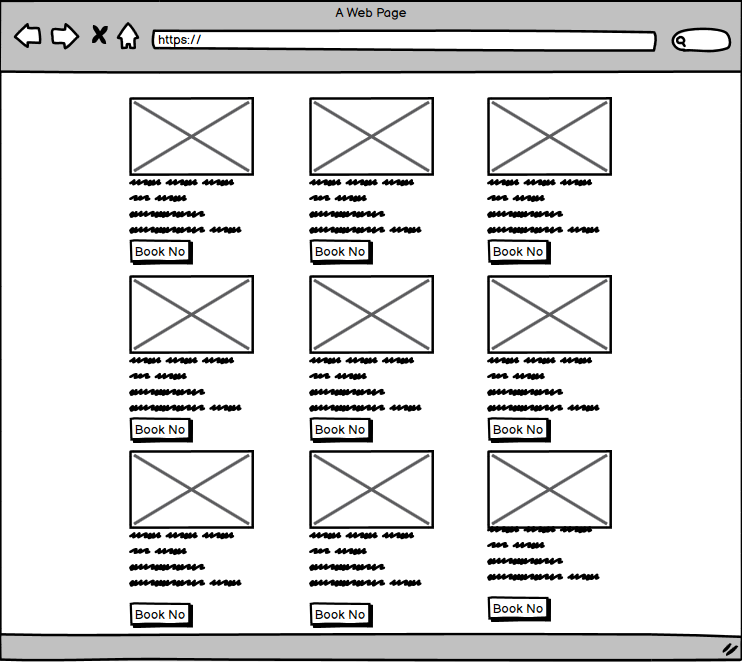

<h1 align="center">EliteFitGym</h1>

Code Institute Diploma in Full-Stack Software Development Project 2

##### <u>Project name:</u>EliteFitGym

### View the live project: https://8000-copper-basilisk-mvi0j0y3.ws-eu03.gitpod.io/

### <u>Scope of the project</u>

 Nowadays, when people don't care so much about health and movement because of their way of life, and when because of today's technologies, they sit in offices
 in a range of physical guilt. The idea of the EliteFitGym concept was born, which will be available to everyone
 with various individual and group training. We offer you the opportunity to train 0-24 7 days a week. Our team of coaches is at your disposal to help.

-----------------
### <u>Contents</u>

- [UX Design](#ux-design--presentation)

- [Wireframing](#wireframing)

  - [Landing](#landing)
  - [Page layout](#page-layout)
  - [Contact Form](#contact-form)
  - [Navigation](#navigation)
  - [Footer](#footer)

- [Technologies Used](#technologies-used)
   - [Adding Email JS SDK](#adding-email-js-sdk)
   - [Adding the Google Maps API](#adding-the-google-maps-api)

- [Credits](#credits)

-----------------
### UX Design / Presentation

#### User Stories

###### As a visitor to the GYM site I expect:

- To be presented with an appealing page using appropriate quality and format imagery.
- To be presented a responsive website that looks good on multiple form factors and screen sizes.
- To be able to find the information I am looking for.
- To be able to easily navigate on the page.
- To be able to execute the expected functions on all the included links and buttons.
- To be able to get in touch with the service provider.

###### As the operator of the GYM site I expect:
  
- To provide basic information about EMM and it's services.
- The customers to read what was published in the press about EMM. (like customer testimonials)
- Visitors to be able to interact with the included map.
- Visitors to easily navigate on the site not coming across any broken links or buttons.
- The customers to be invoked to contact GYM and avail of their services so they can provide personalized information to the future customer.

###### My thoughts as a developer:

"As a beginner, I wanted to create a website with a more modern look from my first project. I tried to create something more visually 
appealing, and more attractive so that whoever checks my GitHub repository will see my improvement. The Code Institute gave me a better 
understanding of the knowledge needed for this project I managed to get to everything faster and clearer than on the first project, which can
be seen if we compare the first and second project. I have a much clearer concept of page design and README file and it was nice to learn how to install add-ons and other functions!"

-----------------

#### **Wireframing**

###### Home Page 

> I wanted to create a page with photos that could be scrolled to the left or right. At the top left is the logo and at the right is the menu.

#### Classes Page 

> On the classes page, the focus is placed on the menu with my classes, all classes have a photo and a description of possible exercises. And every possible
 class has the possibility of booking, when you press the button for booking pages it takes you to the contact form.

 