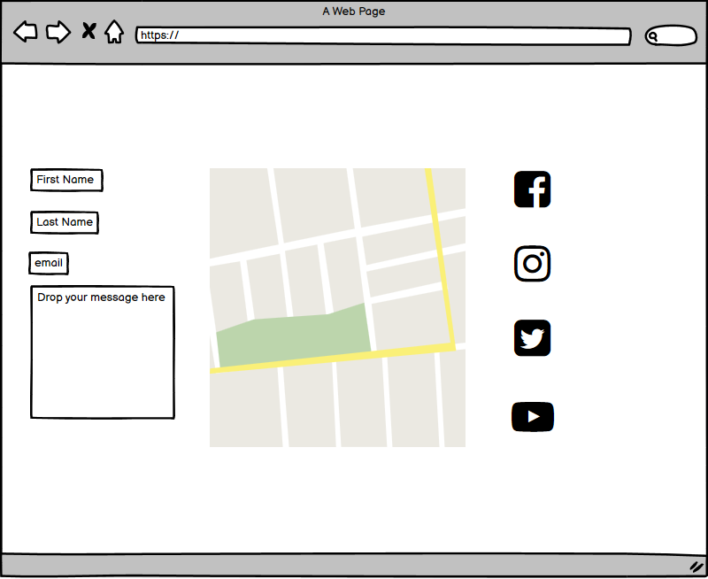
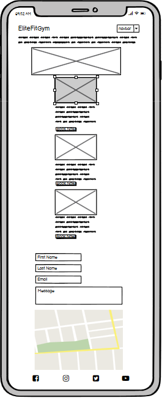
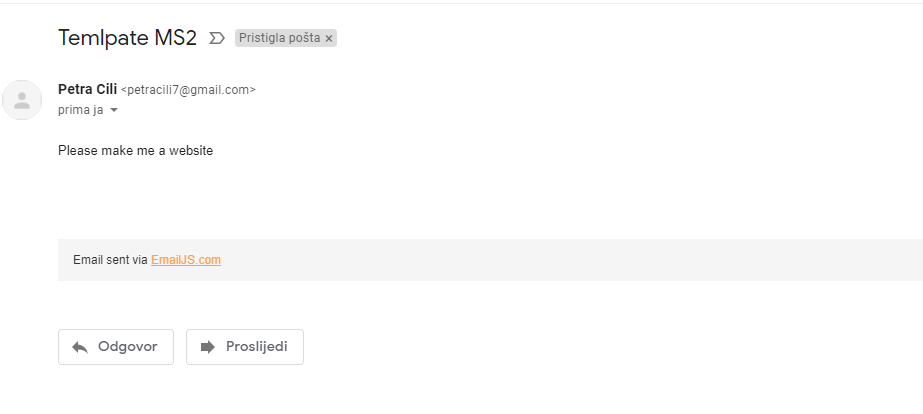

<h1 align="center">EliteFitGym</h1>

Code Institute Diploma in Full-Stack Software Development Project 2

##### <u>Project name:</u>EliteFitGym


### View the live project: https://petracili.github.io/MS2/

### <u>Scope of the project</u>

 Nowadays, when people don't care so much about health and movement because of their way of life, and when because of today's technologies, they sit in offices
 in a range of physical guilt. The idea of the EliteFitGym concept was born, which will be available to everyone
 with various individual and group training. We offer you the opportunity to train 0-24 7 days a week. Our team of coaches is at your disposal to help.

-----------------
### <u>Contents</u>

- [UX Design](#ux-design--presentation)

- [Wireframing](#wireframing)

  - [Landing](#landing)
  - [Page layout](#page-layout)
  - [Contact Form](#contact-form)
  - [Navigation](#navigation)
  - [Footer](#footer)

- [Technologies Used](#technologies-used)
   - [Adding Email JS SDK](#adding-email-js-sdk)
   - [Adding the Google Maps API](#adding-the-google-maps-api)

- [Credits](#credits)

-----------------
### UX Design / Presentation

#### User Stories

###### As a visitor to the GYM site I expect:

- To be presented with an appealing page using appropriate quality and format imagery.
- To be presented a responsive website that looks good on multiple form factors and screen sizes.
- To be able to find the information I am looking for.
- To be able to easily navigate on the page.
- To be able to execute the expected functions on all the included links and buttons.
- To be able to get in touch with the service provider.

###### As the operator of the GYM site I expect:
  
- To provide basic information about EMM and it's services.
- The customers to read what was published in the press about EMM. (like customer testimonials)
- Visitors to be able to interact with the included map.
- Visitors to easily navigate on the site not coming across any broken links or buttons.
- The customers to be invoked to contact GYM and avail of their services so they can provide personalized information to the future customer.

###### My thoughts as a developer:

"As a beginner, I wanted to create a website with a more modern look from my first project. I tried to create something more visually 
appealing, and more attractive so that whoever checks my GitHub repository will see my improvement. The Code Institute gave me a better 
understanding of the knowledge needed for this project I managed to get to everything faster and clearer than on the first project, which can
be seen if we compare the first and second project. I have a much clearer concept of page design and README file and it was nice to learn how to install add-ons and other functions!"

-----------------

#### **Wireframing**

###### Home Page 


> I wanted to create a page with photos that could be scrolled to the left or right. At the top left is the logo and at the right is the menu.

###### Classes Page 


> On the classes page, the focus is placed on the menu with my classes, all classes have a photo and a description of possible exercises. And every possible
 class has the possibility of booking, when you press the button for booking pages it takes you to the contact form.

###### Location ana Booking Page 



>On the location in booking page, the focus is on the section that has a google map in the middle and on the left, there is a form for contacting the gym owner regarding booking classes. While in the right corner 
there is a footer form in which there are holes for social networks, by clicking on the icon it takes you to the home page of the social network.

###### Phone wireframing



> the idea of the page layout on the phone is to reduce the page to the size of the phone screen, and to make the images smaller as well and to arrange the text and button of the images for booking

-----------------

#### **Colors scheme and typography**

 I have used the Noto Sans from Google Fonts. I have chosen the Noto Sans because it's handwriting calligraphy style for the title. Every other visible text is using Noto Sans.

 The site heavily relies on imagery so I wanted to find a balance between colors. I chose a blue colour that is soothing and encourages creativity, which I think is a great choice for a page that focuses on a healthy lifestyle.

I gave the pages a blue colour for the frame at the top and a blue background for the photos on the home page, and the letters are black to achieve better contrast and be easy to read. The rest of the text is in black to make it easier to read and button blue has also been added to give it a more dynamic look.

-----------------

#### Languages Used

- [HTML5](https://en.wikipedia.org/wiki/HTML5)
- CSS3](https://en.wikipedia.org/wiki/Cascading_Style_Sheets)
- JavaScript](https://en.wikipedia.org/wiki/JavaScript)


#### Frameworks, Libraries & Programs Used

- Google Maps Marker Clusterer
- Git Version Control 
- GitHub - to host the repository and the live site
- [Bootstrap](https://getbootstrap.com/) 
- [Email JS](https://www.emailjs.com/) - for making the contact form alive
- [FontAwesome](https://fontawesome.com/) - for the icons used
- [W3Schools Online Web Tutorials](https://www.w3schools.com) - for easier handling of codes
- [Animate.css](https://animate.style/) - for animating element on the landing page 
- [Google Fonts:](https://fonts.google.com/) - for font on webpage
- [HTML Color Codes:](https://htmlcolorcodes.com/) - for color codes and names
- Code Institute - for reminder of how the element is used
- [Grammarly](https://www.grammarly.com) - to correct grammar

#### Adding Email JS 

Adding this functionality to a website was covered in the Interactive Frontend Development module of the course. Those few videos were a great help. Firstly you have to be registered to this service then you will be able to link it with an existing email address. The official EmailJS documentation is also crucial to understand what has to be done in order to get everything in working order. You can find the documentation [here](https://www.emailjs.com/docs/introduction/how-does-emailjs-work/).

#### Adding the Google Maps API

Firstly you have to register for Google Cloud Services. It is easier if you already use Gmail for example. You can do that at the following [link](https://cloud.google.com/).

Once you logged in you have to set up billing for your account. Only then you are able to create a project and be able to use an API or an SDK. Here is the part of the documentation that helps you going through [these steps](https://developers.google.com/maps/gmp-get-started). 
For Google Maps you need to get a personal API key. Here is [how to do that](https://developers.google.com/maps/documentation/javascript/get-api-key). 

It's best practice to restrict the use of your API key in order to avoid unauthorized use and extra charges applied to your account. Google Cloud services actually sent me an email when I first pushed my HTML code to my repository on GitHub saying that it might accidentally have been published and the best thing would be to restrict access if it has not been done already. You can read more on how to do that [here](https://developers.google.com/maps/api-key-best-practices?hl=en). My API key is restricted. The Google Maps map in my project only functions if it's called from the Deployed Website on GitHub pages, GitPod, or LiveServer from VS Code when I use it locally. 
You can find information on how to place markers and use the marker clusterer on a map in the Google Maps JavaScript API Documentation [here](https://developers.google.com/maps/documentation/javascript/overview#maps_map_simple-javascript).

-----------------

### **Version Control**

I used Git for version control and uploading the project to GitHub.
My GitHub repository for this project is accessible [here](https://petracili.github.io/MS2/).

### Testing write-up

HTML code validated on - https://validator.w3.org/

CSS code validated on - https://jigsaw.w3.org/css-validator/

- Upon sending a message through the contact form, the site visitor will receive an automated email response to the email address they have provided previously in the form. I Tested this functionality on my email accounts. The right is the email provided while filling the form. This has got the automated message after clicking send.



A member of Code Institute Anna Greaves has mentioned this handy tool in her ["How to README.md"](https://www.youtube.com/watch?v=7BteidgLAyM&feature=youtu.be&ab_channel=CodeInstitute) online webinar.

### Deployment

 1. On GitHub, navigate to your site's repository.
 2. Under your repository name, click **Settings**.
 3. Under "GitHub Pages", use the **None** or **Branch** drop-down menu and select a publishing source.
 4. Optionally, use the drop-down menu to select a folder for your publishing source.
 5. Click **Save**.

### Cloning this repository

If you'd like to see and work on my code locally feel free to clone the repository. When you clone a repository, you copy the repository from GitHub to your local machine. 
1. On GitHub, navigate to the main page of the repository.
2. Above the list of files, click **Code**.
3. To clone the repository using HTTPS, under "Clone with HTTPS", click . To clone the repository using an SSH key, including a certificate issued by your organization's SSH certificate authority, click **Use SSH**, then click . To clone a repository using GitHub CLI, click **Use GitHub CLI**, then click .
4. Open Git Bash.
5. Change the current working directory to the location where you want the cloned directory.
6. Type `git clone`, and then paste the URL you copied earlier.

   ```shell
   $ git clone https://github.com/petracili/MS2.git
   ```

7. Press **Enter** to create your local clone.

GitHub documentation on cloning repository includes other methods to using the console. You can read more [here](https://docs.github.com/en/free-pro-team@latest/github/creating-cloning-and-archiving-repositories/cloning-a-repository).

### Credits

***Antonio Rodrigez*** - My mentor at Code Institute - for general feedback and guidance, special guidance on Google Maps

***Matt Rudge*** - Lecturer/Developer at Code Institute - for the [template](https://github.com/Code-Institute-Org/gitpod-full-template) used with GitPod IDE for developing this project, and the lecture on Email JS

***Anna Greaves*** - Developer at Code Institute - for the ["How to README.md"](https://www.youtube.com/watch?v=7BteidgLAyM&feature=youtu.be&ab_channel=CodeInstitute) webinar

***Bootstrap*** - for providing [documentation](https://getbootstrap.com/docs/4.5/getting-started/introduction/) on the framework

***W3schools*** - for various code segments, examples and [explanations](https://www.w3schools.com/) used throughout the project

***Font Awesome*** - CDN for [icons](https://fontawesome.com/) used in the project

***Google Fonts*** - CDN for [fonts](https://fonts.google.com/) used in the project
